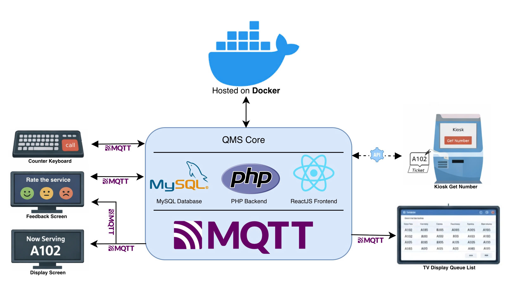
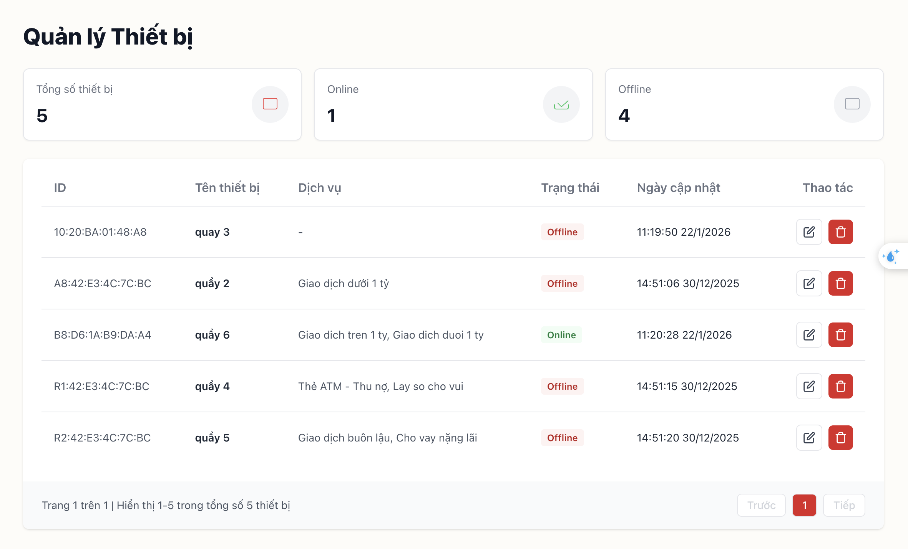
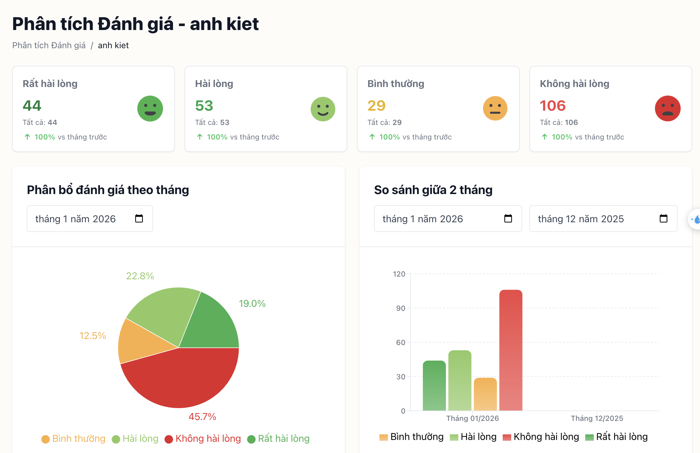
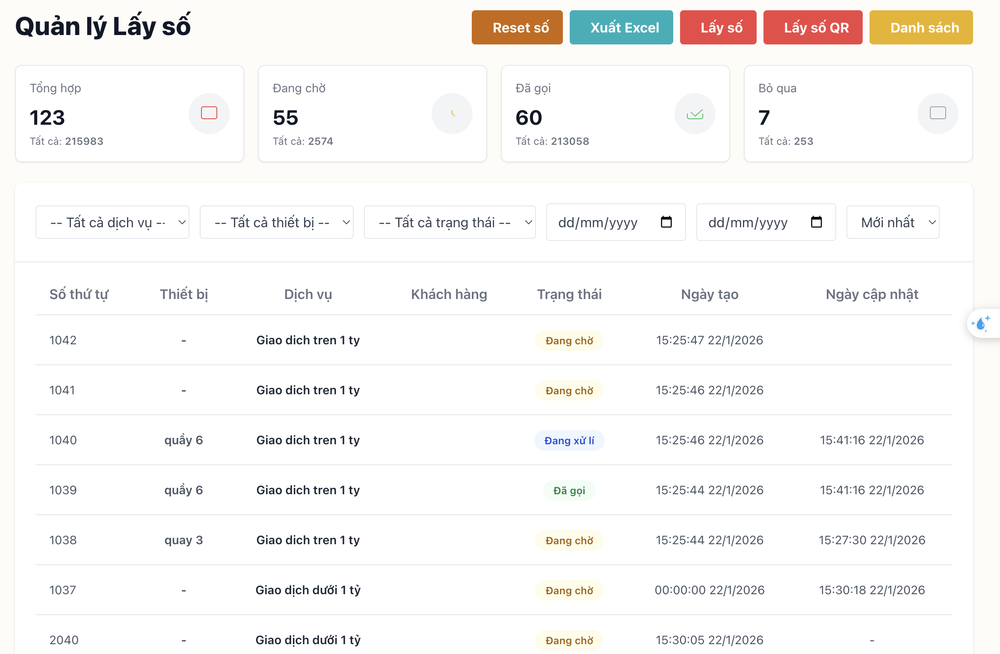
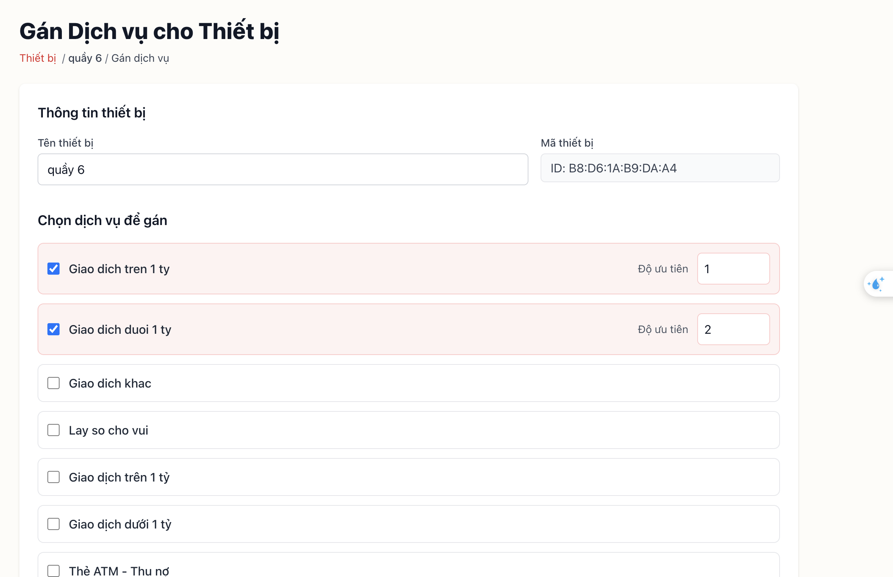
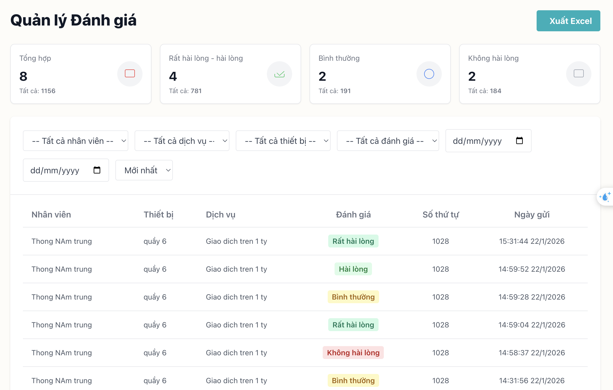
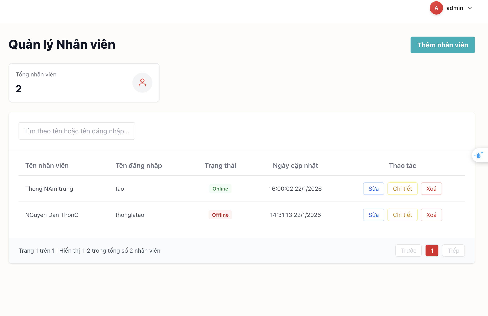

# QMS Core Project Overview

This project focuses on creating the core system for a **Queue Management System (QMS)**, designed to streamline and improve the flow of customers or users in various service environments, such as banks, clinics, customer service counters, or retail outlets. The goal is to integrate multiple components that work together to handle queues effectively, from generating call numbers to collecting feedback.

---

## Key Features:

- **Real-time Queue Management**: Provides an efficient mechanism to manage customers in a queue.
- **Kiosk Ticketing System**: Allows customers to generate queue numbers.
- **Real-Time Updates with MQTT**: Ensures that all devices (counter keyboards, display screens, feedback systems) stay synchronized.
- **Data Management**: Tracks all data related to queue numbers, service feedback, and staff KPIs.

---

## Architecture



---

## How It Works

The **Queue Management System (QMS)** efficiently manages the flow of customers through multiple components integrated in real-time. Below is a step-by-step explanation of how the system functions:

#### 1. **Kiosk Ticket System**:

Customers interact with the **Kiosk** to receive a queue number. Upon pressing "Get Number," the kiosk sends a request to the **QMS Core** via an API, which generates a new queue number (e.g., A102). The kiosk then prints this number on a ticket for the customer.

#### 2. **QMS Core Server**:

The **QMS Core**, hosted on **Docker**, serves as the heart of the system, managing all interactions between devices. The server utilizes:

- **PHP Backend** for business logic and queue management.
- **ReactJS Frontend** for displaying the user interface.
- **MySQL Database** for storing queue data and customer feedback.
- **MQTT Broker** for enabling real-time communication between all system components.

#### 3. **Real-Time Updates with MQTT**:

The **MQTT** messaging protocol enables instant synchronization across devices. Key devices communicate with the **QMS Core** using MQTT:

- **Counter Keyboard**: Staff use this device to manually call the next customer. Once the number is called, the system publishes the update to MQTT.
- **Display Screen**: The display shows the current queue number (e.g., "Now Serving: A102") in real-time, updating automatically as numbers are called.
- **Feedback Screen**: After service, customers provide feedback via this screen, which sends ratings (e.g., positive, negative) back to the QMS server through MQTT.
- **TV Queue Display**: Displays a live list of queue numbers, showing the order in which they are called by the counter keyboard.

#### 4. **Managing Online and Offline States**:

The **QMS Core** can monitor the online and offline status of both the **Counter Keyboard** and **Display Screens**:

- **Online State**: When a device is online, it can send and receive real-time updates via MQTT, ensuring that all devices show the latest information.
- **Offline State**: If a device goes offline, the system will adjust accordingly:
  - **Counter Keyboard**: Temporarily disables the ability to call new queue numbers and alerts staff of the issue.
  - **Display Screens**: Will not show the current queue number until reconnected, at which point the system automatically synchronizes and displays the correct number.

#### 5. **Data Management**:

The **QMS Core** allows for the management of all relevant data from every component of the system. This includes:

- **Queue Data**: Tracks the number of customers in the queue, the number called, and the number served.
- **Feedback Data**: Ratings provided by customers after being served.
  All data is stored in the **MySQL Database** and can be accessed via the admin panel for analysis and reporting.

---

## **API Documentation**

### **Kiosk Number API Endpoints**

These endpoints manage generating tickets, validating/generating QR codes, and providing basic service/config data for kiosks.

#### **Ticket Management**

- **POST /ticket/{id}**: Create a new ticket for service `{id}`.
- **POST /ticketAuth/{id}**: Create a new ticket for service `{id}` (authenticated variant).
- **GET /ticket/detail/{id}**: Retrieve ticket details by ticket id.
- **GET /ticket/validate-qr**: Validate a QR code for a ticket.
- **GET /ticket/generate-new-qr**: Generate a new QR code for a ticket.

#### **Service Management**

- **GET /service/list**: List available services for ticket generation.
- **GET /service/activelist**: List active/enabled services.

#### **Public Auth (Kiosk/Public Clients)**

- **POST /login**: Log in and receive a JWT token.

---

### **QMS Core Dashboard API Endpoints** (Requires JWT)

Administration and dashboard endpoints for staff, devices, services, tickets, logs, feedback, and configuration. All routes below require the **Authorization** header: `Bearer <token>`.

#### **Auth / User**

- **POST /logout**: Invalidate the current token / logout.
- **PUT /changePassword/{id}**: Change password for user `{id}`.

#### **Staff Management (prefix: /staff)**

- **GET /staff**: List staff.
- **GET /staff/list**: Alternate staff listing for UI tables.
- **GET /staff/{id}**: Get staff detail.
- **POST /staff**: Create staff.
- **PUT /staff/{id}**: Update staff.
- **DELETE /staff/{id}**: Delete staff.

#### **Service Management (prefix: /service)**

- **GET /service**: List services (admin).
- **GET /service/{id}**: Get service detail.
- **POST /service**: Create service.
- **PUT /service/{id}**: Update service.
- **DELETE /service/{id}**: Delete service.

#### **Device Management (prefix: /device)**

- **GET /device**: List devices.
- **GET /device/list**: Alternate device listing.
- **GET /device/{id}**: Device detail.
- **PUT /device/{id}/assignService**: Assign a service to a device.
- **DELETE /device/{id}**: Remove a device.

#### **Ticket Administration (prefix: /ticket)**

- **GET /ticket**: List tickets (admin).
- **GET /ticket/export**: Export tickets (CSV/Excel).

#### **Dashboard & Charts**

- **GET /columnChart**: Column chart data.
- **GET /circleChart**: Pie/donut chart data.
- **GET /feedbackChart**: Feedback-related chart data.

#### **Feedback**

- **GET /feedback**: List feedback entries.
- **GET /feedback/export**: Export feedback.
- **GET /feedback/monthly-stats**: Monthly aggregated feedback stats.

#### **Configuration (prefix: /config)**

- **POST /config/buttons**: Save button configuration.
- **POST /config**: Create/store configuration.
- **POST /config/{id}**: Update configuration.
- **GET /config/reset**: Reset numbering/counters.

#### **Activity & Deployment Logs**

- **GET /activity-logs**: Application activity logs.
- **GET /deployment-logs**: MQTT logs.

---

## MQTT Documentation

This section documents MQTT topics used by the system (via the `MqttSubscribe` command). Each topic includes its purpose and example payload(s).

### Topics

#### `requestnumber`

**Purpose:** Request (call) a new number for the calling device.  
**Payload:**

```json
{ "device_id": "B8:D6:1A:B9:DA:A4" }
```

#### `responsenumber`

**Purpose:** Response topic for returning a called number (or no availability) back to the requesting device.  
**Payload:**

```json
{ "device_id": "B8:D6:1A:B9:DA:A4", "number": "1111" }
```

```json
{ "device_id": "B8:D6:1A:B9:DA:A4", "number": "NoAvailable" }
```

#### `feedback`

**Purpose:** Save customer feedback submitted from devices.  
**Payload:**

```json
{
  "device_id": "B8:D6:1A:B9:DA:A4",
  "staff_id": 2,
  "value": 3,
  "number": "1028"
}
```

#### `staff/status`

**Purpose:** Retrieve/update the status used by the feedback screen (e.g., whether a staff member is available/online for feedback).  
**Payload:**

```json
{ "status": "offline", "device_id": "10:20:BA:05:9B:9C" }
```

```json
{ "staff_id": 2, "status": "online", "device_id": "10:20:BA:05:9B:9C" }
```

#### `devicelogin`

**Purpose:** Submit staff credentials from a device for validation; on success, the system returns a staff id via the `[device_id]/staff_id` topic.  
**Payload:**

```json
{ "device_id": "10:20:BA:05:9B:9C", "username": "tao", "password": "1111" }
```

#### `[device_id]/staff_id`

**Purpose:** Return the login result for a specific device (success/failure + staff id).  
**Payload:**

```json
{ "status": "false", "message": "Incorrect username or password" }
```

```json
{ "status": "true", "message": 2 }
```

#### `device/status`

**Purpose:** Update or report the status of a counter keyboard/device (e.g., online/offline).  
**Payload:**

```json
{ "device_id": "B8:D6:1A:B9:DA:A4", "status": "online" }
```

#### `recallnumber`

**Purpose:** Request a recall of the currently processing number for the given device.  
**Payload:**

```json
{ "device_id": "B8:D6:1A:B9:DA:A4" }
```

#### `skipnumber`

**Purpose:** Mark the currently processing number as **skipped** for the given device.  
**Payload:**

```json
{ "device_id": "B8:D6:1A:B9:DA:A4" }
```

#### `requestskipnumber`

**Purpose:** Request the number that was skipped by this device.  
**Payload:**

```json
{ "device_id": "B8:D6:1A:B9:DA:A4" }
```

#### `specificnumber`

**Purpose:** Request a priority/specific number entered on the counter keyboard.  
**Payload:**

```json
{ "device_id": "B8:D6:1A:B9:DA:A4", "number": "1038" }
```

#### `transfernumber`

**Purpose:** Transfer the current number to another counter and mark it as **waiting**. The transferred number remains at the top and will be called on the next call.  
**Payload:**

```json
{ "number": "1038", "device_id": "10:20:BA:01:48:A8" }
```

#### `transferservice`

**Purpose:** Transfer the current number to another service and specify queue position (`0` = bottom, `1` = top).  
**Payload:**

```json
{ "number": "2040", "service_id": "12", "position": 0 }
```

```json
{ "number": "1037", "service_id": "12", "position": 1 }
```

#### `device/register`

**Purpose:** Register a new device into the system.  
**Payload:**

```json
{ "device_id": "B8:D6:1A:B9:DA:A4" }
```

---

## **User Interface (UI) / Screenshots**

<div style="display: flex; flex-wrap: wrap; gap: 10px;">
  
  
  
  
  
  
</div>
---

## **Get Going!**

- Setup MQTT Broker for communication between all system components [set up](./mqtt/mqtt.md).
- Run the app with docker compose [set up](./mqtt/run-the-app.md).

---
